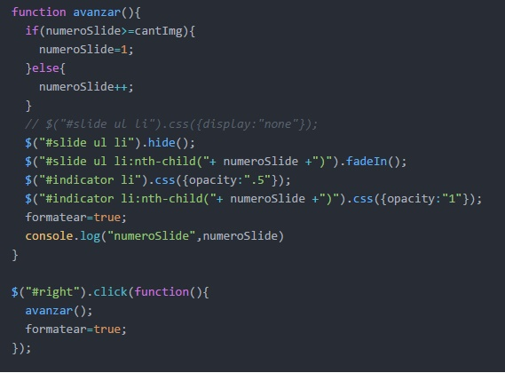
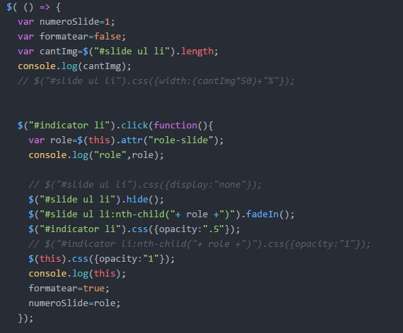
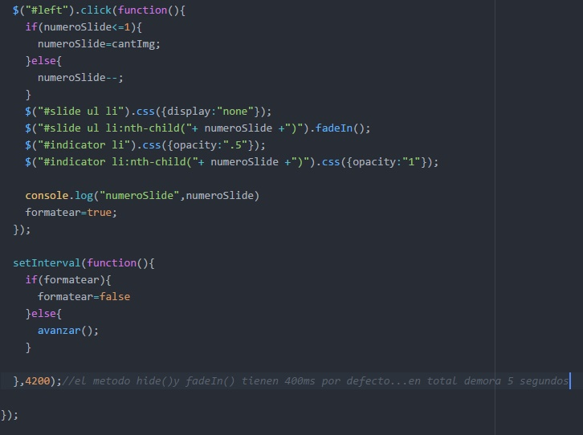
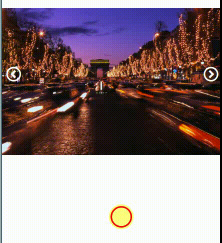

# Carrusel | Sin plugin

- El proyecto consiste en realizar un carrusel de 5 imágenes que pasen de forma automática cada 5 segundos y también se pueda cambiar la imagen al pulsar las flechas laterales o los puntos indicadores.

## Fuentes consultadas:
- jQuery: url(http://api.jquery.com/hide/)

## Carrusel: contenido jQuery

### Función avanzar
En esta función, para que avance de forma automática(cada 5 segundos, se tomo en cuenta el tiempo que tienen por defecto los métodos hide y fadeIn), hacemos uso de un contador de slides y de los métodos de jQuery como hide(), fadeIn() y css(). Usamos la misma función para avanzar con la flecha right 

### Para que cambie con el indicador
Aquí aplicamos el método attr(), capturamos el valor de ese atributo y lo pasamos como párametro, para detectar que imagen debemos mostrar.(se sigue usando hide(), fadeIn y css()) 

### Flecha
Esta función es similar a la de avanzar sólo que el contador disminuye. 

## Versión Desktop 
Así se ve en la versión desktop:  

## Versión Mobile

## Desarrollado con:

`HTML` `JavaScript` `CSS` `JQUERY`  

##  Créditos* 
* [Stephanie Hiyagon](https://github.com/stephHiyagon)
